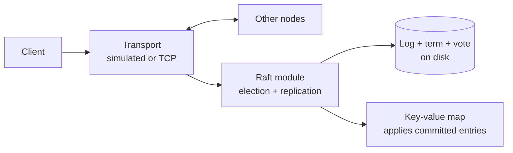
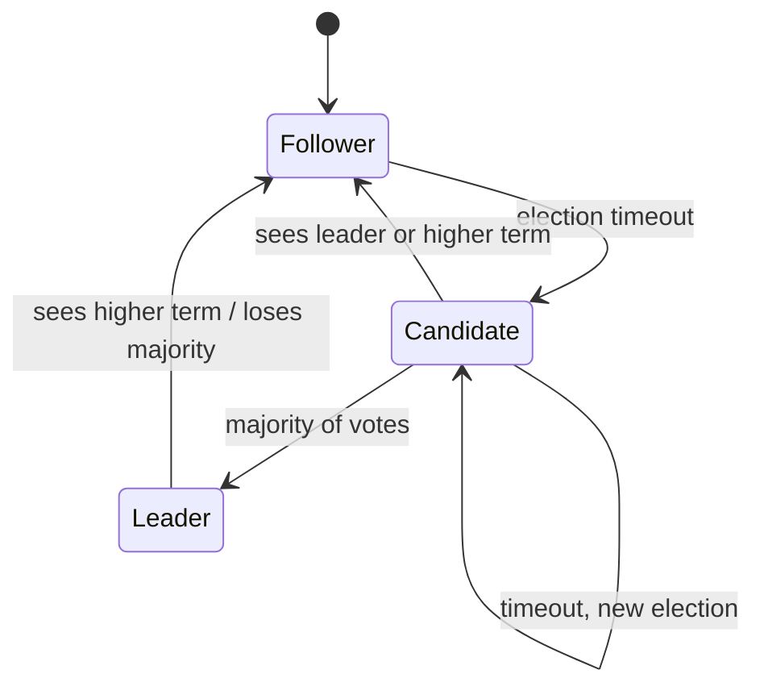

# raft-kv

A fault-tolerant key-value store in Java. Five nodes keep identical copies of the data using the Raft consensus algorithm, which I implemented from scratch following the paper (no consensus libraries). A deterministic fault-injection simulator and a linearizability checker I wrote test it under crashes, partitions and message loss.



Kill the leader in the middle of a stream of writes. A new leader takes over in about 200-300 ms, writes continue, and no acknowledged write is lost ([demo output](docs/demo-output.txt)).

## Quick start

You need JDK 21 (`brew install openjdk@21`). Gradle is included via the wrapper.

```bash
./scripts/start-cluster.sh          # builds, then starts 5 node processes on ports 7001-7005
```

In another terminal:

```bash
./scripts/kv.sh put color blue
./scripts/kv.sh get color
./scripts/kv.sh status              # role, term and commit index of every node
./scripts/kv.sh                     # interactive shell
```

Kill any node (`kill -9 <pid>`, the pids are printed at startup) and keep using the client. Node data lives in `data/node-N/`. Restart with `./scripts/start-cluster.sh --fresh` to wipe it.

Other commands:

```bash
./gradlew test                      # everything below, including 10,000 randomized fault runs
./gradlew demo                      # the leader-kill demo on a real 5-process cluster
./gradlew bench                     # throughput / latency / failover, writes docs/results.md
./gradlew sim --args="--seeds 100000"
./gradlew sim --args="--seed 42 --verbose"   # replay one run with every node's log
```

## What it does

| Feature | Where |
|---|---|
| Leader election with randomized timeouts (150-300 ms), heartbeats every 50 ms | `raft/RaftNode.java` |
| Log replication, consistency check, fast log repair using conflict term/index hints | `raft/RaftNode.java` |
| Commit only by majority, only for current-term entries (plus a no-op at the start of each term) | `advanceCommitIndex()` |
| Persistence: term, vote and log fsynced before any reply; torn writes detected by CRC | `raft/FileStorage.java` |
| Key-value state machine with client sessions, so a retried write applies exactly once | `kv/KvStateMachine.java` |
| Linearizable reads with ReadIndex: the leader confirms it still has a majority, no log write needed | `linearizableRead()` |
| Check-quorum: a leader that can't reach a majority steps down | `heardFromMajorityRecently()` |
| Batching (group commit) and pipelining of AppendEntries | `propose()` / `flushProposals()` |
| TCP transport, 5 separate JVM processes, CLI client that follows leader redirects | `transport/`, `client/` |

Each node runs all Raft logic on a single thread. Network threads only decode bytes and hand messages to that thread, so Raft state needs no locks. Raft never reads the wall clock or creates its own randomness. It only sees the `RaftEnv` interface, which the simulator and the real runtime each implement.



More detail on the write path, the read path and the simulator is in [docs/architecture.md](docs/architecture.md).

## How it's tested

`./gradlew test` runs four levels of tests:

1. **Unit tests** for each RPC handler's edge cases: a vote request from an old term, a second candidate in the same term, AppendEntries with a mismatched previous entry, stale or duplicated AppendEntries, a leader stepping down on a higher term, and the Figure 8 commit rule (`RaftNodeTest`). Storage has its own tests, including crash-in-the-middle-of-a-write (`FileStorageTest`).
2. **Scenario tests** for cases that break naive implementations (`ScenarioTest`):
   - a leader partitioned away while it still believes it is leader
   - a node offline for 8+ terms that comes back and catches up
   - all 5 nodes losing power at once
3. **Randomized simulation.** All 5 nodes run in one JVM on a simulated network that drops, delays, reorders and duplicates messages. A random schedule crashes and restarts nodes and partitions the network. Everything comes from one seed, so any failure replays exactly. After **every simulated event**, the five safety properties from the Raft paper are checked: Election Safety, Leader Append-Only, Log Matching, Leader Completeness, State Machine Safety. After each run, every operation must have finished and every node must hold the same data.
4. **Linearizability checking.** Every client operation's invoke time, return time and result is recorded. A Wing & Gong search (with Lowe's memoization, the same approach as Knossos and Porcupine) checks that one valid order exists, per key.

**Results:** 10,000 randomized runs in `./gradlew test` (19 s on a 2-core VM), plus 100,000 more seeds via `./gradlew sim`. In total that's about 29 million client operations and 400,000 leader elections checked, with **0 violations**. The simulator also passes with 3 and 7 nodes, with 12-second fault phases, without batching and without check-quorum.

**Do the checkers actually catch bugs?** Each bug below can be switched on (`PlantedBug`), and a test confirms it gets caught:

| Planted bug | Caught by | Runs that fail |
|---|---|---|
| Followers answer reads from local state | linearizability checker | 97 / 200 |
| Leader answers reads without confirming its majority | linearizability checker, plus a scenario test | 27 / 1,000 |
| No deduplication of retried writes | linearizability checker, plus an exactly-once count | 73 / 300 |
| Commit old-term entries by counting replicas (Figure 8) | unit test `figure8...` | see note |

Note: the random runs never hit the Figure 8 bug, because each new leader commits a no-op from its own term first, and that hides the bad rule. The unit test builds the exact Figure 8 state by hand instead.

One thing the simulator taught me: with an election timeout of 60-80 ms, a 50 ms heartbeat and network delays up to 30 ms, 227 of 3,000 runs never settled. Followers kept timing out before heartbeats arrived, so there was always a new election. Safety still held, since no invariant broke, but the cluster couldn't make progress. The timeout has to be well above heartbeat interval plus network delay, which is why the paper says to use 150-300 ms.

## Performance

5 processes on one machine over localhost TCP, every append fsynced. From `./gradlew bench` ([docs/results.md](docs/results.md)):

| Configuration | Write throughput | Write p50 | Write p99 | Read p50 | Failover (median / max) |
|---|---|---|---|---|---|
| No batching | 1,022 ops/s | 28.2 ms | 79.3 ms | 1.44 ms | 337 / 435 ms |
| Batching + pipelining | 4,376 ops/s | 5.7 ms | 26.0 ms | 1.47 ms | 209 / 345 ms |

Measured on a 2-CPU Linux VM with 32 closed-loop clients, so all five nodes and the clients were sharing two cores. On a Mac with more cores the numbers will be higher. Rerun `./gradlew bench` to get yours.

Batching helps because one fsync and one AppendEntries per follower covers every proposal that arrived together, instead of one of each per write. Failover time is mostly the election timeout: followers wait 150-300 ms without a heartbeat before they start an election.

## Layout

```
src/main/java/raftkv/
├── raft/       election, replication, log, persistence (RaftNode, RaftLog, FileStorage)
├── kv/         key-value state machine, client sessions + dedup, node runtime (KvNode)
├── transport/  message types, binary codec, TCP transport
├── client/     Java client + command-line tool
├── sim/        simulator, fake clock, simulated network, fault injection, invariant checks
├── checker/    linearizability checker
└── bench/      load generator, local multi-process cluster, leader-kill demo
src/test/java/raftkv/   unit, scenario, randomized and real-TCP tests
docs/           architecture notes, benchmark results, demo output
```

## Known limitations / what I'd build next

- **No snapshots or log compaction.** The log grows forever, and a restarted node replays it from index 1. The next step would be InstallSnapshot.
- **No membership changes.** The cluster is fixed at startup.
- **Client sessions never expire.** Every client ID stays in the dedup table. A real system expires them (the dissertation, §6.3, covers how).
- **One outstanding request per client.** Dedup only tracks each client's latest sequence number.
- **fsync on macOS.** `FileChannel.force` doesn't issue `F_FULLFSYNC`, so a power cut on a Mac could lose writes still in the drive's cache. A `kill -9` is fine.
- **Single-threaded node loop.** Simple and lock-free, but one core per node limits throughput. Moving disk writes off the Raft thread (with care about ordering) would be next.

## References

- Ongaro & Ousterhout, [In Search of an Understandable Consensus Algorithm](https://raft.github.io/raft.pdf) (Figure 2 is the spec this follows)
- Ongaro, [Consensus: Bridging Theory and Practice](https://web.stanford.edu/~ouster/cgi-bin/papers/OngaroPhD.pdf) (no-op entries, ReadIndex, check-quorum, client sessions)
- Lowe, *Testing for Linearizability*, Concurrency and Computation: Practice and Experience, 2017 (the checker's algorithm; [Porcupine](https://github.com/anishathalye/porcupine) uses the same one)
