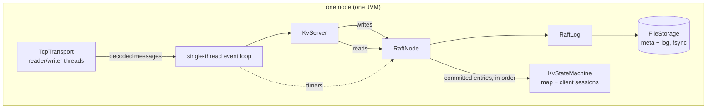
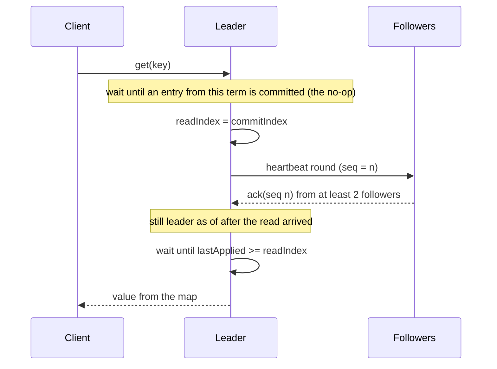

# Architecture notes

## One node



Everything in `RaftNode` runs on one thread: messages, election timers, heartbeats and batch flushes are all events on the same queue. That thread is the only one that touches Raft state, so there are no locks. `RaftNode` gets time, randomness, timers and message sending only through `RaftEnv`. In the simulator those come from the fake clock and the seeded `Random`. In a real node they come from `System.nanoTime` and a `ScheduledExecutorService`.

## Write path

```mermaid
sequenceDiagram
  participant C as Client
  participant L as Leader
  participant F as Followers (4)
  C->>L: ClientRequest(put, clientId, seq)
  Note over L: buffer proposal; flush after queued events
  L->>L: append batch to log, fsync once
  L->>F: AppendEntries(prevLogIndex, prevLogTerm, entries, leaderCommit)
  F->>F: consistency check, append, fsync
  F-->>L: success, matchIndex
  Note over L: majority has it and it's from the current term, so commit
  L->>L: apply to map (dedup by clientId/seq)
  L-->>C: OK
  L->>F: next heartbeat carries new commitIndex
```

- If the leader loses leadership before the entry commits, the client gets NOT_LEADER and retries with the **same** `(clientId, seq)`. If the first attempt did commit after all, the session table returns the saved result and doesn't run it again.
- A follower whose log disagrees answers with `conflictTerm`/`conflictIndex`, so the leader can skip back a whole term at a time instead of one entry per round trip.
- The leader advances `nextIndex` as soon as it sends (pipelining) and corrects it if a follower rejects.

## Read path (ReadIndex)



Reads don't touch the log or the disk. The heartbeat round is what makes them safe: a leader that has been partitioned away can't collect a majority of acks, so it can't answer with stale data. Reads that arrive together share one heartbeat round.

## The simulator

`Simulator` has one priority queue of events ordered by `(time, sequence number)`, one fake clock, and one `java.util.Random` seeded from the run's seed. Nothing else in a simulated run produces time or randomness, and nothing iterates over hash-ordered collections, so a seed always replays the same run event for event (`DeterminismTest` checks this).

`SimNetwork` gives each message a random delay, which reorders messages for free. It also drops messages with some probability, duplicates a few, and silently discards anything that crosses a partition or goes to a crashed node. A crashed node's storage (`MemoryStorage`) survives, like a disk. When the node restarts, a fresh `RaftNode` loads from it with empty volatile state, and timers from the old incarnation are ignored.

Each `RandomizedRun`:

1. Draws network settings: delay range, loss rate (0-10%), duplication rate (0-3%).
2. Fault phase (3 s): every 20-420 ms it does one of the following at random: crash a node (often the leader, and sometimes a majority), restart one, partition the cluster (often isolating the leader), heal, or change the loss rate.
3. Settle phase (2.5 s): heals everything and restarts every node. Clients stop issuing new operations 1 s before the end.
4. At the end it checks that every client operation finished, that all nodes applied the same entries and hold the same map, and that the history is linearizable.

## Checking the safety properties cheaply

Checking Log Matching after every event by comparing whole logs would be far too slow for 10,000 runs. Instead, `RaftLog` keeps a running hash of each prefix: `h[i] = mix(h[i-1], term_i, command_i)`. Two logs with the same `h[i]` hold the same entries 1..i. The checker then works like this:

- **Log Matching**: after each event, only the indexes that changed since the last check are compared against the other nodes. Wherever the terms are equal, the prefix hashes must be equal.
- **State Machine Safety**: the first node to apply index i records `h[i]`, and every later apply at i must match.
- **Leader Completeness**: when a node becomes leader of term T, its log must contain the prefix hash of the highest index committed before term T.
- **Election Safety**: a map from term to leader id.
- **Leader Append-Only**: the log counts its truncations, and a leader's count must not change during its term.

## Linearizability checker

Linearizability is compositional: a history is linearizable if and only if each key's sub-history is. So `LinearizabilityChecker` splits by key and runs the Wing & Gong search on each:

- It walks the time-ordered list of call/return events. It tries to "linearize" (remove) each operation whose call appears before any unmatched return, as long as the operation is consistent with the register's current value. When it reaches a return it couldn't satisfy, it backtracks.
- It memoizes `(set of linearized ops, register value)` so it never explores the same state twice (Lowe, 2017).
- An operation that never returned might have happened, so a pending write is kept with an infinite return time. Pending reads are dropped, since nobody saw their result.
- Operations whose times touch within the same millisecond are treated as concurrent.

Every value a client writes is unique (`c<client>-<seq>`), which keeps the search short. A failure prints the operation that couldn't be placed and the ones around it.
